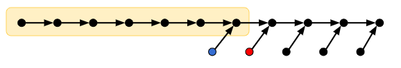

# 合併插入排序

Lester Ford, Jr. 以及 Selmer Johnson 把 [Howard B. Demuth](https://www.uidaho.edu/engr/departments/ece/our-people/emeriti/howard-demuth) 的 1957 年博士論文裡面提到的 5 筆資料排序方法進行推廣，最終獲得一個用謹慎的方法試圖減少比較次數的排序方法──**合併插入排序 Merge Insertion Sort**。
這個排序法的名字是高德納教授（Donald Knuth）在他撰寫的《The Art of Computer Programming》裡面取的。
附帶一提，最近 MIT 教授 Lex Fridman 釋出了一段與 Knuth 的訪談[^1]：https://www.youtube.com/watch?v=2BdBfsXbST8 大家有興趣可以聽聽看。

## 如何避免大量的天花板

演算法的核心概念是這樣的：如果看到一個長度為 $2^k-1$ 元素的序列，那麼此時將一個新的元素插入其中，是最不會浪費「資訊」的。因為資訊理論下界 $\ceil{\log_2 ((2^k-1)+1)}$ 無論有沒有天花板，其數值都是一樣的，得花費恰巧 $k$ 次才能夠找出新元素的落點。

如果長度不到 $2^k-1$ 的序列怎麼辦？盡量讓這件事情不要發生就好了！
乍看之下很困難啊──但是 Ford-Johnson **盡量**做到了，最重要的想法可以透過下面這張圖來傳達：

假設我們能夠經過若干次比較之後，把所有元素的大小關係描述成上面這張圖。其中 $x\to y$ 代表經過比較以後，我們得出了 $x < y$ 這項結論。
上圖黃色框線內共有 7 個元素，若我們想將紅色元素插入上面長鏈中，此時恰好達到資訊理論下界的 $\log_2(7+1) = 3$ 次。因此可以得到結論是：此時優先將紅色元素插入長鏈、再將左邊的藍色元素插入長鏈。其需要的比較次數至多是 $\log_2(7+1) + \log_2(7+1) = 6$ 次。相反地，若我們先插入藍色元素，再插入紅色元素，在最壞情形下我們得花費 $\log_2(7+1) + \ceil{\log_2(8+1)} = 7$ 次比較才能達到效果。

行文至此，不難發現，如果我們有辦法把輸入資料的大小關係，表達成上圖這種牙刷形狀，再依照最不浪費比較次數的方式進行二分插入，說不定可以得到較佳（比較次數較小）的排序演算法。

## 合併插入排序的第一步

要怎麼生出牙刷呢？
首先，在分而治之的部分，我們先將資料隨意地兩兩分成一組，並且花費 $\floor{n/2}$ 次比較。
如果有多出來的元素，就先放在旁邊吧。
接下來，我們可以遞迴針對比較大的那些 $\floor{n/2}$ 元素進行排序，就可以把它們接成一長串了！
最後是刷毛整理的部分：我們將刷毛由左至右（資料可以命名為 $b_1, b_2, \ldots, b_{\ceil{n/2}}$）分成若干組，而每一組的數量都會滿足：把這組資料由右至左依序進行二分插入法，都是最不浪費資訊的。

我們現在來引用 Donald Knuth 《The Art of Computer Programming》裡面提到的分析技巧[^2]：

這些組別分起來，會長得像這樣：$\{b_1\}$、$\{b_2, b_3\}$、$\{b_4, b_5\}$、$\{b_6, b_7, b_8, b_9, b_{10}, b_{11}\}$…。我們可以令 $t_k$ 代表最大的註標使得把跟它分派到同一組的所有元素，依照反過來的順序依序二分插入序列時，最壞情形下每次都恰好需要 $k$ 次比較。即，跟 $t_0$ 同一組的資料插入序列恰好需要 0 次比較、跟 $t_2$ 同一組的資料插入序列需要 2 次比較、依此類推。

要怎麼找出 $t_k$ 的值呢？注意到，當 $b_{t_k}$ 的筆資料被插入序列的時候，所有註標不超過 $t_{k-1}$ 的資料已經被加入序列了。此外，所有註標等於 $t_{k-1}+1, \ldots, t_k$ 的元素都還沒有被加入序列。也就是說，此時序列恰恰好有 $2t_{k-1}+(t_k-t_{k-1}-1) = t_{k-1}+t_k-1$ 筆資料！（這個 $-1$ 是因為最後一個註標 $b_{t_k}$ 頭頂上那筆資料不需要被考慮進去，它的資料比所有人都來得大）為了讓資訊不浪費，我們希望 $t_{k-1}+t_k-1 = 2^k-1$。因此得到
$$
t_{k-1} + t_k = 2^k\text{。}
$$
經過一番寒徹骨，不是，經過一翻兩瞪眼以後，不是，總之，經過一直翻一直翻，我們可以得出一個神奇的結論：
$$
\begin{aligned}
t_k &= 2^k - 2^{k-1} + 2^{k-2} - \cdots + (-1)^k2^0\\
 &= (2^{k+1}+(-1)^k)/3.
 \end{aligned}
$$

有了這個演算法以後，我們就可以利用遞迴方法來分析，這個合併插入排序需要的比較總次數了。我們令 $F(n)$ 表示對 $n$ 筆資料進行 Merge-Insertion Sort 最壞情形下所需要的比較次數。
那麼可以得到遞迴關係：

$$
F(n) = \floor{n/2} + F(\floor{n/2}) + G(\ceil{n/2})
$$

其中，$G(\ceil{n/2})$ 表示著當牙刷刷毛有 $\ceil{n/2}$ 根的時候（分別是 $b_1, b_2, \ldots, b_{\ceil{n/2}}$），要合併成一條單鏈需要的比較次數。藉由 $\{t_i\}$ 的表示法，若 $t_{k-1} < \ceil{n/2}\le t_k$，我們可以把 $G(\ceil{n/2})$ 寫成

$$
\begin{aligned}
G(\ceil{n/2}) &= \sum_{i=1}^{k-1} i (t_i-t_{i-1}) + k(\ceil{n/2} - t_{k-1}) \\
&= k\ceil{n/2} - (t_0 + t_1 + \cdots + t_{k-1})
\end{aligned}
$$

令 $w_k = t_0+t_1+\cdots + t_{k-1} = \floor{2^{k+1}/3}$。
現在來證明今天最重要的一個結論：

### 引理 22

$ F(n) - F(n-1) = k $ 若且唯若 $w_k < n \le w_{k+1}$。

### 證明

我們可以用數學歸納法。Base Case 很顯然，所以就不寫了。Inductive Case 的部分可以利用 $n$ 的奇偶性分別討論：如果 $n$ 是偶數，那麼 $F(n)-F(n-1) = 1+F(n/2)-F(n/2-1)$，後半部的數值等於 $k-1$ 若且唯若 $w_{k-1} < \floor{n/2} \le w_{k}$。而由 $w_k$ 之定義可知 

$$
\begin{aligned}
&& w_{k-1} & < & n/2 & \le   w_{k}  & \text{（} n \text{ 是偶數。）}\\
&\Longleftrightarrow & \floor{2^{k}/3} & < & n/2 & \le  \floor{2^{k+1}/3} \\
&\Longleftrightarrow & 2\floor{2^{k}/3} & < & n & \le  2\floor{2^{k+1}/3} \\
&\Longleftrightarrow & 2\floor{2^{k}/3}+1 & < & n & \le  2\floor{2^{k+1}/3} & \text{（} n \text{ 是偶數，這很重要。）} \\
&\Longrightarrow & \floor{2^{k+1}/3} & < & n & \le  \floor{2^{k+2}/3} \\
\end{aligned}
$$

於是 $n$ 是偶數的時候結論成立。第二種情形，當 $n$ 是奇數的時候，我們可以依樣畫葫蘆：

$$
F(n)-F(n-1) = G(\ceil{n/2})-G(\ceil{(n-1)/2})
$$

然後這個值是 $k$ 若且唯若 $t_{k-1} < \ceil{n/2} \le t_k$，然後這個等價於 $w_k < n\le w_{k+1}$，得證。

-----

有了引理 22 以後，我們試圖找出 $k$ 與 $n$ 之間的關係。因為 $w_k < n \le w_{k+1}$，所以 $k$ 可以寫成 $\ceil{\log_2 \frac{3}{4}n}$。於是得到很酷的結論：

$$
F(n) = \sum_{i=1}^n \ceil{\log_2 \frac{3}{4}i} \approx n\log_2 n - 1.415n + O(\log_2 n)
$$

還記得二分插入法的上界、以及資訊理論下界嗎？我們把它們同步列出來：

$$
A(n) = \ceil{\log n!}  \approx n\log_2 n - 1.443 n + O(\log_2 n)
$$

$$
B(n) = \sum_{i=1}^n \ceil{\log i} \approx n\log_2 n - 0.915 n + O(\log_2 n)
$$

不難發現 $F(n)$ 比起二分插入法得到的比較次數 $B(n)$，更接近資訊理論下界 $A(n)$ 了呢！

### 結論

後話就是，在 1979 年 Manacher[^3] 用了混合方法，把 Hwang-Lin[^5] 的兩序列合併演算法考慮進去並且在某些情形下改良，同時改進了 Ford-Johnson 演算法，並且證明了**存在無窮多個** $n$，其最少比較排序的比較次數比 $F(n)$ 嚴格來得小，該方法贏過 FJ 的最小值是 $n=189$。然後到了 1985 年 Bui 和 Thanh[^4] 再次修改了 Manacher 演算法，得出在絕大多數的 $n$ 時，FJ 演算法不是最優的。而且也得出了最小反例出現在 $n=47$（到 2007 年為止，Peczarski[^6] 聲稱 FJ 演算法在 $n<47$ 的時候是最佳解，Peczarski 證明了利用某一類型的分而治之演算法無法在 $n\le 46$ 的時候贏過 FJ 演算法。）

然後 $F(n)$ 其實有封閉形式（Closed Form，俗稱公式解）：
$$
F(n) = n\ceil{\log_2 \frac{3}{4} n} + \floor{\frac13 2^{\log_2 6n}} + \floor{\frac12\log_2 6n}\text{。}
$$

最後，大家要多多刷牙喔 ^_<。

### 推薦閱讀

* 維基百科：https://en.wikipedia.org/wiki/Merge-insertion_sort
* Ford-Johnson 演算法當年的論文：https://www.jstor.org/stable/pdf/2308750.pdf

[^1]: 感謝 a127 的告知與推薦！
[^2]: Donald Knuth, _The Art of Computer Programming_, Volumn 3, Page 183-187.
[^3]: Glenn K. Manacher, _The Ford-Johnson Sorting Algorithm Is Not Optimal_, 1979. https://dl.acm.org/doi/pdf/10.1145/322139.322145
[^4]: T. D. Bui and Mai Thanh, _Significant improvements to the Ford-Johnson algorithm for sorting_, BIT 1985. https://link.springer.com/article/10.1007/BF01934989
[^5]: 交大黃光明教授與 S. Lin（我查不到…）當年在貝爾實驗室發表的論文：F. K. Hwang and S. Lin, _A Simple Algorithm for Merging Two Disjoint Linearly Ordered Sets_, SIAM Journal of Computation, 1972. https://epubs.siam.org/doi/abs/10.1137/0201004
[^6]: Marcin Peczarski, _The Ford–Johnson algorithm still unbeaten for less than 47 elements_, IPL 2007 February. https://www.sciencedirect.com/science/article/pii/S0020019006002742