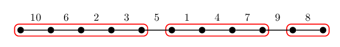
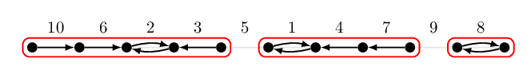
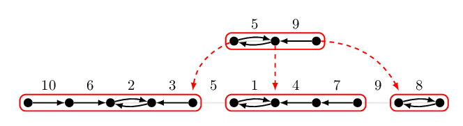

# Borůvka 樹分治（一）：直線上的 Borůvka

今天我們聊聊比較輕鬆的話題。
在邁向更多的最小生成樹演算法之前，我們先來看幾個例子：在一些相對單純的圖上面跑 Borůvka 演算法。我們發現在一條簡單路徑、或是在一棵樹上直接執行 Borůvka 演算法，會得到一個有趣的、充滿單調性的資料結構。而這個結構（我們不妨稱之為 **Borůvka 樹分治**），可以幫助我們解決一類常見的**靜態離線**區間極值問題。

### 前情提要

Borůvka 演算法是由不超過 $O(\log n)$ 個 Borůvka 步驟組成。在每一個 Borůvka 步驟中，我們對所有的點挑選往最小權重的外連邊，這些邊（可能會被重複挑選）將形成一個森林。將該森林的所有連通元件全部縮起來變成一個點，並且移除所有的自連邊、並在所有重邊中留下權重最小的一條，結束這個 Borůvka 步驟。

Borůvka 演算法跑在什麼樣子的圖是有效率的呢？下面這個引理率先給了三個例子。

### 引理 MST.12

1. 如果輸入的圖是一條**簡單路徑**，那麼在上面跑 Borůvka 演算法只需要 $O(n)$ 的時間。
2. 如果輸入的圖是**一棵樹**，那麼在上面跑 Borůvka 演算法只需要 $O(n)$ 的時間。
3. 如果輸入的圖是**簡單平面圖**，那麼在上面跑 Borůvka 演算法只需要 $O(n)$ 的時間。

### 引理 MST.12 的概略證明

首先，不難發現一條簡單路徑、樹、簡單平面圖，其邊數都是 $O(n)$ 的。
經過一次 Borůvka 步驟以後，縮起來的圖也分別仍是一條簡單路徑、樹、簡單平面圖。但根據引理 MST.7，每縮一次點數至多剩一半。因此整體的時間複雜度是 $O(n + n/2 + n/4+\ldots) = O(n)$。

------

接下來，我們來探索一下 Borůvka 步驟帶給我們的有趣性質吧！

## 在直線上進行 Borůvka 步驟

如果這張圖是一條簡單路徑，那麼進行一次 Borůvka 步驟以後，
形成的森林也都會是由簡單路徑組成，如下圖所示：

這些森林並不是任意的簡單路徑！如果我們多看兩眼，而且把「每條邊被哪一個點選中」的理由用一個箭頭表示，那麼我們會發現，每一個連通的簡單路徑，其邊的權重都是**先遞減再遞增**的。

若重複進行 Borůvka 步驟，那麼把這些步驟依序畫出來，可以用一棵樹狀結構來表示。這棵樹的深度取決於進行 Borůvka 步驟的次數，而且最大深度不超過 $\log n$。

這個先遞減再遞增的特性，可以幫助我們回答下面這個問題：

### 區間最大值問題

> 給定一個序列 $a_1, a_2, \ldots, a_n$ 以及 $m$ 筆詢問 $\{[l_i, r_i]\}_{i=1}^m$。對於每一個詢問 $i$ 我們想知道區間內的最大值 $\max_{l_i\le j\le r_i} a_j$。

如上面圖片給的例子，我們的輸入是 $n=10$、$a=[10, 6, 2, 3, 5, 1, 4, 7, 9, 8]$。如果我們想知道詢問 $L=2, R=4$ 的答案，也就是 $[6, 2, 3]$ 之間的最大值，我們可以先看看在最底層 $L$ 和 $R$ 是否屬於第一次 Borůvka 步驟的連通元件。如果是的話，根據**先遞減再遞增**的特性，此時必定有 $\max_{L \le j\le R} a_j = \max(a_L, a_R)$。換句話說，這時候我們只需要檢查兩個數字就可以得知答案了！

如果是另一個情形：詢問的兩個邊界並不屬於第一次 Borůvka 步驟的連通元件。那麼我們可以依循剛才建構出的樹狀結構，同時讓兩個邊界往上爬，直到它們出現在同一個連通元件為止。在往上爬的過程中，記錄下經過的所有連通元件中的相鄰邊，裡面出現的最大值就是我們要的解。

由於樹的高度只有 $O(\log n)$ 甚至更小，因此每一次詢問需要的時間是 $O(\log n)$。

### 係理 MST.13

存在一個 $O(n)$ 時間預處理、$O(\log n)$ 時間回答每個區間最大值詢問的演算法。

### 為什麼標題叫做樹分治？

在下一篇文章中，我們將重新看待這個樹狀結構。King 在 1997 年發表的論文[^3]中，將上述的想法給出更具體的轉化 (Reduction)，而且她的方法也適用於輸入不僅僅是一個序列，還可以是一棵樹。

### 備註

對於區間極值問題，是存在 $O(n)$ 時間預處理、$O(1)$ 時間回答區間最大值的演算法的。不過該演算法需要使用查表技術，這個技術通常被稱為間接查表 Indirection[^1] 或是四俄羅斯人方法 Methods of Four Russians[^2]。

[^3]: Valerie King, [A Simpler Minimum Spanning Tree Verification Algorithm](https://www.cs.princeton.edu/courses/archive/fall03/cs528/handouts/A%20Simpler%20Minimum%20Spanning.pdf), Algorithmica 1997.

[^1]: Michael A. Bender and Martin Farach-Colton, [The Level Ancestor Problem Simplified](https://link.springer.com/chapter/10.1007/3-540-45995-2_44), LATIN 2002.

[^2]: 維基百科 [Method of Four Russians](https://en.wikipedia.org/wiki/Method_of_Four_Russians)。

