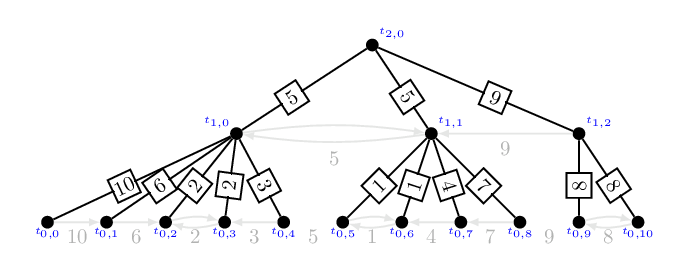

# Borůvka 樹分治（二）：King's 轉化

King's 轉化（King's Reduction）將我們前一篇提到的區間最大值的問題，變成一個樹上路徑最大值問題（Tree Path Maximum）。我們接續前一篇所舉的例子：

在這個例子中，若我們將每一次 Borůvka 步驟所獲得的連通元件具體定義為樹上的一個點，並且與連通元件內的所有點都連起來（並且給予適當的權重），就會形成以下的樹 $B$。

大家不妨可以檢驗看看，隨意挑選一個區間，這個區間的起點和終點會對應到該樹上的兩片葉子。而區間內數值的最大值，會恰好等於樹 $B$ 中的兩個點之間路徑上的最大權重。值得一提的是，在樹 $B$ 當中的這條路徑，不見得恰好包含原本區間內的所有數值，它可能會多一些數值、也可能會少一些數值。但這個 King's 轉化厲害的地方是，這條路徑總是包含最大值、而且這個轉化也適用於輸入是一棵樹的情形。

現在讓我們來仔細定義這棵樹。對於一個輸入的樹 $T=(V, E)$（上述例子中，這棵樹是一條路徑），我們先執行一連串的 Borůvka 步驟。
並且我們定義 $t_{i, j}$ 為第 $i$ 次 Borůvka 步驟找出的第 $j$ 個連通元件。
為了方便起見我們將原本樹 $T$ 的點集合 $V$ 寫作 $V=\{t_{0, j}\}$。
定義樹 $B$ 如下：
* $B$ 的所有節點，為所有連通元件所形的集合 $\{t_{i, j}\}$。樹根為 $t_{\ell, 0}$，而 $\ell\le \log |V|$ 為 Borůvka 步驟進行的總次數。
* 樹 $T$ 的每一個節點 $t_{0, j}$，對應到樹 $B$ 的一片葉子。
* 對於所有連通元件 $t_{i, j}$，它與所有屬於該連通元件的前一層節點 $t_{i-1, k}$ 都建立一條邊，且權重定義為 $T$ 上面由 $t_{i-1, k}$ 往外連所有邊中權重最小值。

### 性質 MST.14

上述定義之樹 $B$ 的確是一棵樹，而且每一個內部節點至少有兩個以上的子節點。

### 性質 MST.14 的證明

由於 $T$ 是連通的，因此其定義出來的樹 $B$ 的確是一棵樹。此外，由於每一次的 Borůvka 步驟，會將每一個連通元件與至少另一個連通元件合併。因此每個 $B$ 上面的第 $i$ 層的內部節點 $t_{i, j}$ 至少有兩個位於第 $i-1$ 層的鄰居。

-------

對於所有葉子深度都相同、並且每個內部節點都有兩個或更多的子節點的樹，我們稱為**完滿分叉樹（Full Branching Tree）**。這樣的性質保證了建構出來的 $B$ 不會太大。

### 係理 MST.15 (證明略)

假設輸入之樹 $T$ 節點數有 $n$ 個。那麼樹 $B$ 的節點數不超過 $2n-1$。

-------

接著我們證明這個定義出來的樹 $B$ 上面關於區間最大值的最重要性質：

### 引理 MST.16 [[^1]]

對於給定的兩個點 $u:=t_{0, j}$ 以及 $v:=t_{0, k}$，$u$ 和 $v$ 之間在 $T$ 上路徑 $u\leadsto_T v$ 的最大邊權，總是等於這兩點在 $B$ 上路徑 $u\leadsto_B v$ 的最大邊權。

### 引理 MST.16 的證明

對於每條邊 $e$ 我們用 $w(e)$ 來表達它的權重。首先，我們證明對於任何一條 $B$ 上面路徑的邊 $e\in u\leadsto_B v$，都能找得到一條 $T$ 上面路徑的邊 $e'\in u\leadsto_T v$ 使得 $w(e') \ge w(e)$。
令 $e=(t_{i-1, x}, t_{i, y})$，由註標可知，$t_{i-1, x}$ 在 $T$ 上代表的是一個連通元件，而在第 $i$ 次 Borůvka 步驟執行時，$t_{i-1, x}$ 選擇了邊權重為 $w(e)$ 的邊，這條邊是所有 $t_{i-1, x}$ 外連的邊中權重最小者。

此外，由於 $e$ 是 $e\in u\leadsto_B v$ 的一條邊，這蘊含了 $u$ 與 $v$ 恰有一個點在 $t_{i-1, x}$ 所在的連通元件裡面、另一個點在外面。因此，在 $T$ 的路徑 $u\leadsto_T v$ 上面存在一條邊 $e'$ 是從 $t_{i-1, x}$ 跨出去的，從前述對 $w(e)$ 的推論可知此時必定有 $w(e') \ge w(e)$。

接下來，我們證明在 $u\leadsto_T v$ 這條路徑中的最重邊 $e'=(a, b)$，其權重值必定出現在 $u\leadsto_B v$ 上面。不妨假設這個權重 $w(e')$ 是路徑上唯一的。此時我們宣稱，在某一次 Borůvka 步驟執行時，當 $a$ (或 $b$) 所在的連通元件 $t_{i, j}$ 選擇了 $e'$ 這條邊作為外連邊進行合併的時候，該連通元件必定包含 $u$ 或 $v$ 至少一個點。證明如下：若不然，當 $a$ (或 $b$) 所在的連通元件選擇了 $e'$ 這條邊作為外連邊進行合併時，$u\leadsto_T v$ 這條路徑上至少有兩條不同邊跨越 $t_{i, j}$ 這個連通元件。然而，$e'$ 是比較重的那條，根據 Borůvka 步驟的描述 $t_{i, j}$ 是不可能選擇 $e'$ 合併的，與 $t_{i, j}$ 挑選 $e'$ 這個假設矛盾。

另一方面，$t_{i, j}$ 挑選 $e'$ 合併時，$u$ 或 $v$ 也剛好有一個點不在其中：若不然，代表有另一條路連接 $u$ 到 $v$，與 $T$ 為一棵樹的假設矛盾。既然 $t_{i, j}$ 挑選 $e'$ 合併時，$u$ 或 $v$ 恰好有一個點在其中，這代表 $(t_{i, j}, t_{i+1, j'})$ 這條邊出現在 $u\leadsto_B v$ 這條路徑上，而且其權重恰好等於 $w(e')$，得證。

------

於是乎，任何經過 King's 轉化的樹，任兩點之間的距離都不超過 $\log n$（根據最小共同祖先 LCA 的位置，只要往上爬不超過 $\ell$ 層再往下走就能走到另一點啦。）因此，上述轉化不只是解決了區間最大值問題，還可以解決樹上路徑最大值問題：

### (靜態離線) 樹上路徑最大值問題 Tree Path Maximum

> 給定一棵有邊權的樹 $T$，以及一系列**預先給定好**的詢問 $\{(u_i, v_i)\}_{i=1}^m$。對於每一個詢問，請回答 $T$ 上面連接 $u_i$ 與 $v_i$ 的這條唯一路徑上，所有邊權重的最大值。

### 定理 MST.17

存在一個 $O(n+m\log n)$ 時間複雜度的演算法，解決樹上路徑最大值問題。

### 定理 MST.17 的證明

我們可以先花線性時間 $O(n)$ 對 $T$ 跑一次 Borůvka 演算法，並且算出 King's 轉化後的樹 $B$。對於每一筆詢問 $(u_i, v_i)$，同時讓 $u_i$ 和 $v_i$ 在 $B$ 中往上爬，並且記錄中間經過的所有邊權重的最大值。根據引理 MST.16，途中經過得最大值，就會是 $T$ 上面 $u_i$ 到 $v_i$ 路徑上的最大權重，因此答案是正確的。往上爬所需要的時間是 $O(\ell) = O(\log n)$，因此整體時間複雜度是 $O(n+m\log n)$。

## 從幾乎線性到線性

從定理 MST.17 的證明看來，在完滿分叉樹上面解決樹上路徑最大值問題，我們只是很平鋪直敘地應用 King's 轉化，並平鋪直敘地暴力找出每條路徑上的最大邊權。而事實上，我們能夠利用更多的單調性質，並且利用巧妙的位元運算（bit tricks）設計出更快速的演算法！

在下一篇文章中，我們將介紹 Full Branching Tree 上面解決靜態離線樹上路徑最大值問題的 Hagerup 演算法[^2] 與其核心的 Komlós 分析[^3]。

### 為什麼標題叫做樹分治？

樹分治是一種將形狀偏頗的樹轉化成一棵平衡樹的一類技巧。
根據實際需求，在設計資料結構（和演算法）時不一定要實際將轉化的平衡樹算出來，重點是能將長鏈的部分以對數時間方法走訪即可。
這類技巧包含常見的[樹鏈剖分 Heavy-Light Decomposition](https://cp-algorithms.com/graph/hld.html)、[啟發式合併(知乎)](https://www.zhihu.com/question/29663921)、[輕重樹剖分 DSU on Tree](https://codeforces.com/blog/entry/44351)、[最平衡樹分治問題 POI 11th Cave](https://szkopul.edu.pl/problemset/problem/5Z9PRRPP-R90WhmbSY_qHd-1/site/?key=statement)。
它們的核心概念是相同的，但是根據題目需求，建構出來的資料結構或演算法也長得不太一樣，今天我們討論的 King's 轉化就是一類樹分治的演算法。

### 備註

在維多利亞大學（University of Victoria）任職的 Valerie King，於 1995 年發表了一篇驗證最小生成樹的線性時間演算法。該演算法中最重要的一步——也就是 King's 轉化——是將樹上路徑最大值問題（Tree Path Maximum）轉化成完滿分叉樹（Full Branching Tree）上面的路徑最大值問題。

[^1]: Valerie King, [A Simpler Minimum Spanning Tree Verification Algorithm](https://www.cs.princeton.edu/courses/archive/fall03/cs528/handouts/A%20Simpler%20Minimum%20Spanning.pdf), Algorithmica 1997.

[^2]: Torben Hagerup, [An Even Simpler Linear-Time Algorithm for Verifying Minimum Spanning Tress](https://link.springer.com/chapter/10.1007/978-3-642-11409-0_16), WG 2009.

[^3]: János Komlós, [Linear verification for spanning trees](https://link.springer.com/article/10.1007/BF02579443), Combinatorica 1985.