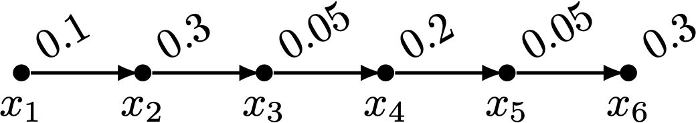
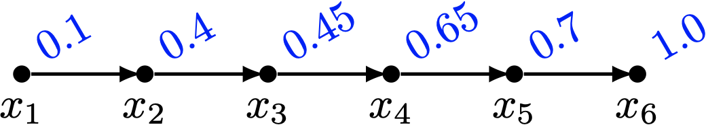

# 偏序集排序（四）

為了繞過使用深奧隨機走訪方法與馬可夫鏈而得到的估計 $e(P)$ 近似演算法，
我們今天把這個順序多胞形轉換一下，變成另一個直鏈和多胞形（Chain Polytope）。

## 直鏈和多胞形 Chain Polytope

在 poset $(P, <)$ 上面的一條**直鏈（chain）** $C\subset P$，其實就是一個任兩元素都可以比較的子集合。
我們考慮以下的**直鏈和多胞形（chain polytope）**：

$$
\mathcal{C}(P) = \{ (z_1, \ldots, z_n) \ |\ \forall \text{ chain } C, 0\le \sum_{x_i\in C} z_i \le 1 \}
$$

換句話說，只要 $n$ 個介於 $[0, 1]$ 之間的實數，滿足對於 poset 之中任何一條直鏈，它對應數字的總和不超過 $1$ 的話，這個點就會被我們加入多胞形之中。

## 兩個多胞形之間的轉換

要怎麼找出直鏈和多胞形 $\mathcal{C}(P)$ 與順序多胞形 $\mathcal{O}(P)$ 之間的關聯呢？
試想像一下，如果我們有一條鏈：

<!--
\tikzset{n/.style={inner sep=0pt, minimum size=4pt, circle, fill=black}}
\tikz{
\foreach \x/\c in {1/0.1,2/0.3,3/0.05,4/0.2,5/0.05,6/0.3} {
  \node[n,label=below:{$x_\x$}](A\x) at (\x, 0) {};
  \node[rotate=30,anchor=west,shift={(0.1, 0.1)}] at (A\x) {\c};
};
\foreach \x in {1,2,...,5} {
\pgfmathsetmacro\y{\x+1}%
\draw (A\x) edge [-latex,thick] ($(A\y)+(-0.1,0)$);
};
}
-->

那麼 $(0.1, 0.3, 0.05, 0.2, 0.05, 0.3, \ldots)\in \mathcal{C}(P)$。由於在 $\mathcal{C}(P)$ 上頭，每一條鏈上面的數值總和都不超過 $1$，透過 **前綴和（Prefix Sum）** 的概念，我們可以定義出一條非遞減的序列如下：

<!--
\tikzset{n/.style={inner sep=0pt, minimum size=4pt, circle, fill=black}}
\tikz{
\foreach \x/\c in {1/0.1,2/0.4,3/0.45,4/0.65,5/0.7,6/1.0} {
  \node[n,label=below:{$x_\x$}](A\x) at (\x, 0) {};
  \node[rotate=30,anchor=west,shift={(0.1, 0.1)},color=blue] at (A\x) {\c};
};
\foreach \x in {1,2,...,5} {
\pgfmathsetmacro\y{\x+1}%
\draw (A\x) edge [-latex,thick] ($(A\y)+(-0.1,0)$);
};
}
-->

每一個點的數值變成了這條鏈上面它所有祖先原本的數值總和，加上自己本身的數值。
不難發現，現在這個賦值方式滿足順序多胞形的條件：
$$
(0.1, 0.4, 0.45, 0.65, 0.7, 1.0, \ldots) \in \mathcal{O}(P)
$$

現在讓我們來考慮推廣版的情形：如果一個點屬於超過一條鏈怎麼辦呢？對於一個點 $z=(z_1, \ldots, z_n)\in\mathcal{C}(P)$，我們可以定義出一個點 $\varphi(z) = (z'_1, \ldots, z'_n)\in\mathcal{O}(P)$，其中 $z'_i = z_i + \max_{j: x_j < x_i} z'_j$。這個轉換 $\varphi$ 其實也是一一對應的：對於一個點 $z' = (z'_1, \ldots, z'_n)\in\mathcal{O}(P)$，我們可以回推出 $\varphi^{-1}(z') = (z_1, \ldots, z_n)\in\mathcal{C}(P)$，使得 $z_i = z'_{i} - \max_{j: x_j < x_i} z'_j$。

因此我們可以說：對於任意偏序集，都存在一個雙射變換 $\varphi_P: \mathcal{C}(P)\to \mathcal{O}(P)$。可惜的是，光憑這個結論，我們無法斷定這兩個多胞形的體積關係。這時候，就是我們前一篇介紹的 Ehrhart 多項式派上用場的時候啦！

### 定理 25 [Stanley 1986][^1]

對於任何偏序集。$\mathcal{C}(P)$ 的體積與 $\mathcal{O}(P)$ 的體積相等。

### 證明

還記得我們說過多胞形的 Ehrhart 多項式嗎？如果把 $\mathbb{R}^n$ 空間中，每一個座標軸放大整數倍 $k$，那麼多胞形內部的格子點（所有座標都是整數的點）的數量會以 $\Theta(k^n)$ 的速度成長，而這個點數可以被一個 $n$ 次多項式表示之。

換句話說，如果我們有辦法證明 $\mathcal{C}(P)$ 與 $\mathcal{O}(P)$，在座標軸放大任意整數倍之後，格子點數仍然相同，那麼很顯然它們有一模一樣的 Ehrhart 多項式（任何一個 $n$ 次單變數多項式可以被 $n+1$ 個取值唯一決定。）

而這個整數點格子數量的結論顯然是正確的：在放大 $k$ 倍之後，若 $kz = (kz_1, kz_2, \ldots, kz_n)$ 是格子點，那麼根據 $\varphi$ 的定義，在變換之後 $\varphi(kz) = kz'$ 也會是格子點。反之亦然。於是，我們就得證啦～

-----

這個直鏈和多胞形有什麼好處呢？它其實有另一個等價的定義：如果我們從偏序集 $P$ 當中，任何兩個可以比較的元素對，都建立一條邊，我們會得到一個無向圖 $G(P)$。$G(P)$ 也被稱為 $P$ 的**可比較圖（Comparability Graph）**。

而 $\mathcal{C}(P)$ 呢，它會恰好等於所有 $G(P)$ 上面「最大獨立集（stable set, independent set）」所對應到的單位向量，與原點形成的凸組合（convex combination）空間。

明天我們來看看這個 $G(P)$ 的補圖 $\overline{G(P)}$ **不可比圖（incomparability graph）**，他對於 $e(P)$ 的估計有什麼厲害的幫助吧！

[^1]: Richard P. Stanley, _Two Poset Polytopes_, 1986. [http://dedekind.mit.edu/~rstan/pubs/pubfiles/66.pdf](http://dedekind.mit.edu/~rstan/pubs/pubfiles/66.pdf)