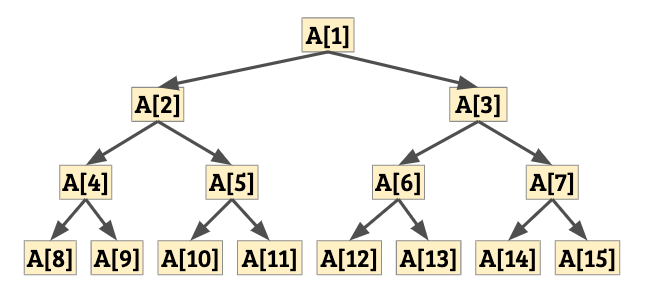

# 堆積排序法

堆積（Heap）是一種**陣列資料結構**。若我們將 $n$ 筆資料的堆積以 $A[1..n]$ 來表示的話，那麼堆積將滿足：對所有 $x$，$A[x] \ge A[2x]$ 以及 $A[x] \ge A[2x+1]$（或是指定位置不存在資料）。我們可以按照註標將陣列資料排列成樹狀的結構：



由於每一個節點內所代表的資料都比其子節點來得大，通常我們把這樣的堆積稱為最大堆積（Max-Heap）。相反地，如果我們維護的條件是 $A[x] \le \min(A[2x], A[2x+1])$，那麼我們會稱它為最小堆積。

### 定義

我們說 $A[x]$ **滿足堆積性質**，若對於所有樹狀結構中 $A[x]$ 的子樹內節點 $A[y]$，都有 $A[y] \ge \max(A[2y], A[2y+1])$。即，如果我們把整個子樹的資料拿出來放在另一個陣列中，那它將是最大堆積。

不難發現，如果 $A$ 是最大堆積，那麼 $A[1]$ 的值是整個陣列中所有資料的最大值。

-----

## Heapify - 作一個整理成堆積的動作

要怎麼把一個陣列整理成堆積呢？我們只需要一種核心操作「向下交換」：

```cpp
void RollDown(data_t *A, const int n, int x) {
  // 邊界條件。
  if (2*x > n) return;
  // 看成樹狀結構時，只有左子樹、沒有右子樹。
  if (2*x+1 > n) {
    if (A[x] < A[2*x]) {
      swap(A[x], A[2*x]);
    }
    return;
  }
  // 若兩邊子樹都存在，則挑大的那邊交換下去，並且遞迴處理。
  if (A[x] < max(A[2*x], A[2*x+1])) {
    int larger = (A[2*x] > A[2*x+1] ? 2*x : 2*x+1);
    swap(A[x], A[larger]);
    RollDown(A, n, larger);
  }
}
```

### 引理 16

若 $A[2x]$ 與 $A[2x+1]$ 分別滿足堆積性質，那麼呼叫 `RollDown(x)` 以後，$A[x]$ 將滿足堆積性質。

### 證明

可以利用數學歸納法來證明：假設對於所有的 $x' > x$ 都已成立。
那麼對於現在這個 $x$ 來說，在呼叫 `RollDown(x)` 以後，首先我們能保證 $A[x] \ge \max(A[2x], A[2x+1])$。
接下來，我們檢視哪些元素被動過了：如果剛才交換的是 $A[x]$ 與 $A[2x]$，那麼另一邊（$A[2x+1]$）整棵子樹是不會變的。
此時，根據歸納假設 $2x > x$，顯然在呼叫下一層遞迴之前，$A[4x]$ 與 $A[4x+1]$ 的資料都沒有變動過，因此它們滿足堆積性質。在呼叫遞迴之後，$A[2x]$ 便滿足了堆積性質，從而得證 $A[x]$ 也滿足堆積性質。根據對稱性，如果剛才交換的是 $A[x]$ 與 $A[2x+1]$，也會保證遞迴執行完畢後，$A[x]$ 也滿足堆積性質。

-----

有了引理 16 以後，我們就可以輕鬆把整個陣列變成堆積了：

```cpp
void Heapify(data_t *A, const int n) {
  // 注意這邊有別於一般陣列：傳入之陣列範圍是 A[1]...A[n]。
  for (int x = n; x >= 1; --x) {
    RollDown(A, n, x);
  }
}
```

正確性可以利用引理 16 輕鬆證得，比較有趣的是時間複雜度的分析。

### 引理 17

`Heapify()` 的時間複雜度為 $O(n)$。

### 證明

對於每一個註標 $x$，呼叫 `RollDown(x)` 時，每一次遞迴呼叫時至少將參數乘以 2，直到超過 $n$ 為止。因此單次呼叫 `RollDown(x)` 的執行時間不超過 $\ceil{\log\frac{n}{x}}$。把它全部加起來，會得到

$$
\begin{aligned}
T(n) \le \sum_{x=1}^n \ceil{\log \frac{n}{x}} &\le \sum_{x=1}^n \left(1 + \log \frac{n}{x}\right)\\
&\le n + \sum_{x=1}^n \log \frac{n}{x}
\end{aligned}
$$

令 $S(n) = \sum_{x=1}^n \log\frac{n}{x}$。推敲一陣可知
$$
S(n) = {\color{purple}{\sum_{x=1}^{n/2} \log\frac{n/2}{x}}} + {\color{green}{\frac{n}{2} + \sum_{x=n/2+1}^n \log\frac{n}{x}}}
\le {\color{purple}{S(n/2)}} + {\color{green}{n}}
$$

於是一路推敲下去可以用數學歸納法證得 $S(n)\le 2n$。所以 Heapify 整體時間複雜度為 $T(n) \le n + S(n) \le 3n = O(n)$。

-----

## 堆積排序

有了堆積以後，就可以進行堆積排序囉。注意到，一個最大堆積其最大值總是出現在 $A[1]$ 的位置。因此，我們可以重複地將最大值放到堆積的末端（第一次交換 $A[1]$ 與 $A[n]$、第二次交換 $A[1]$ 與 $A[n-1]$、依此類推）最終就可以得到一個由小到大排好順序的序列啦！

```cpp
void HeapSort(data_t *A, int n) {
  // 注意這邊有別於一般陣列：傳入之陣列範圍是 A[1]...A[n]。
  Heapify(A, n);
  while (n > 1) {
    swap(A[1], A[n--]);   // 把最大值放到最後一格，並縮減堆積範圍。
    RollDown(A, n, 1);    // 整理完後又是一個最大堆積！
  }
}
```

這個方法的時間複雜度是 Heapify 的時間、加上執行 $n$ 次 `RollDown()` 的時間。
前者耗費 $O(n)$、後者耗費 $\sum_{i=1}^n \log i = \Theta(n\log n)$。
因此總執行時間為 $O(n\log n)$。

### 備註

這個排序方法所需要的額外空間是 $O(1)$，因此堆積排序法是一種原地演算法。

