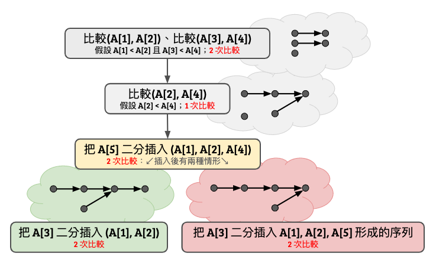

# 最少比較排序

前一篇我們討論了比較排序的下界。對於所有的 $n$，基於比較的排序方法至少要花 $\ceil{\log n!}$ 次比較。
而根據合併排序法、或快速排序法等，我們也知道要完成排序至多只需要 $O(n\log n)$ 次比較。
Lower bound 與 Upper bound 完美地合起來了不是嗎！
俗話說得好，魔鬼藏在細節裡，常數藏在 big-O 裡面。
對於六〇年代的電腦科學家們，不把常數寫清楚是會對自己過意不去的。
換句話說，若先不考慮把演算法實作出來後真正的時間複雜度，我們只關心「比較次數」的話，是否**總是**存在一種排序的演算法，在最壞情形下只需要恰好 $\ceil{\log n!}$ 次比較就能夠排好序呢？

答案是否定的。但是在描述最小反例之前，我們不妨先想想看，究竟可以設計出怎麼樣的演算法，其所需的比較次數與 $\ceil{\log n!}$ 足夠接近：

## 引理 20

存在一種比較排序法，使得排好 $n$ 筆資料至多需要 $\ceil{\log 2} + \ceil{\log 3} + \cdots + \ceil{\log n}$ 次排序。

### 引理 20 的證明

上面這個式子給我們很大的提示：我們只要稍微修改一下**插入排序法**，每一次加入一個數字。但是在加入的時候，我們不從當前序列末端一路比較過來；相反地，我們使用定理 19 提到的**二分搜尋法**，把資料插入目前排好序的序列就可以了。
我們不需要擔心資料搬移所花費的時間，反正資料的搬移在這個比較次數至上的計算模型裡面是免費的！

-----

看來細節不只藏在 big-O 裡面，還藏在天花板裡面呢。

上面這兩個函數到底差多少？令 $A(n) = \ceil{\log n!}$、令 $B(n) = \sum_{i=1}^n \ceil{\log i}$。我們可以簡單寫張表，列出前面幾項數值：

| $n$ | 1 | 2 | 3 | 4 | 5 | 6 | 7 | 8 | 9 | 10 | 11 | 12 |
|:---:|:---:|:---:|:---:|:---:|:---:|:---:|:---:|:---:|:---:|:---:|
| $A(n)$ | 0 | 1 | 3 | 5 | 7 | 10 | 13 | 16 | 19 | 22 | 26 | 29 |
| $B(n)$ | 0 | 1 | 3 | 5 | 8 | 11 | 14 | 17 | 21 | 25 | 29 | 33 |

在 $n=5$ 的時候數字就不一樣了！這不禁讓我們思考：要排好 5 個數字，至少需要進行幾次比較呢？如果是 7 次，那麼代表前述之「二分插入法」不能達到最少比較次數；反之，如果是 8 次，代表基於資訊理論方法得到的下界不是最緊的。無論是哪一種結論好像都讓我們多理解了什麼，對吧～

## 引理 21

存在一個比較排序法，使得正確排序 5 筆資料，在最壞情形下僅需要 7 次比較。這結果真的是令人五筆振奮啊（這裡沒有梗）。

### 引理 21 的證明

證明實在難以用言語形容，直接畫圖比較快。這邊我們假設輸入為 $A[1..5]$。

你看看，無論輸入長什麼樣子，這個決策樹總可以在至多 7 次以內順利排序完畢。而這邊使用到的是二分插入法的概念，只是用了比較取巧的比較順序。西元 1959 年 Ford-Johnson 把這個想法延伸，設計出了一個叫做**合併插入排序法 Merge Insertion Sort** 的排序演算法（其中 Ford 就是 Ford-Fulkerson 演算法裡面的 Ford、Johnson 就是 Johnson 演算法裡面的那位、好吧我不知道我在講什麼。）

如果我們把 FJ 演算法需要的比較次數的前幾項寫出來：

| $n$ | 1 | 2 | 3 | 4 | 5 | 6 | 7 | 8 | 9 | 10 | 11 | 12 |
|:---:|:---:|:---:|:---:|:---:|:---:|:---:|:---:|:---:|:---:|:---:|
| $A(n)$ | 0 | 1 | 3 | 5 | 7 | 10 | 13 | 16 | 19 | 22 | 26 | 29 |
| $FJ(n)$ | 0 | 1 | 3 | 5 | 7 | 10 | 13 | 16 | 19 | 22 | 26 | 30 |

從 $n=2...11$ 全部都是最佳解了！真正難纏的部分是 $n=12$，直到 1965 年 Mark Wells[^1] 率先撰寫程式列舉所有排序結構，證明了 $S(12) = 30$（有興趣的朋友可以參考 Knuth 的 TAOCP，第三卷）。這個結果證明了資訊理論下界不等於最少排序次數。

Ford-Johnson 的合併插入排序法是否真的是最優的呢？可惜的是 1977 年 Manacher[^2] 否定了這件事情：他證明了存在無窮多個 $n$，使得最少排序次數比 $FJ(n)$ 嚴格來得小。目前已知最小的反例是在 $n=189$。

-----

如同四色定理一樣，找出最少比較排序的次數，可以藉由電腦輔助而完成證明。很酷吧！

### 推薦閱讀

* 高德納教授（Knuth）的《The Art Of Computer Programming》第 5.3.1 節。
* 《最少排序問題中 $S(15)$ 與 $S(19)$ 的解決》：http://fcst.ceaj.org/EN/abstract/abstract47.shtml
* 13, 14, 22 個元素排序：https://link.springer.com/content/pdf/10.1007%2Fs00453-004-1100-7.pdf
* $FJ(n)$ 在 $n<47$ 以前都是好的：https://www.sciencedirect.com/science/article/pii/S0020019006002742

[^1]: Mark B. Wells, __Applications of a language for computing in combinatorics__, IFIP 1965.

[^2]: Glenn K. Manacher, __The Ford-Johnson Sorting Algorithm Is Not Optimal__, 1979. https://dl.acm.org/doi/pdf/10.1145/322139.322145