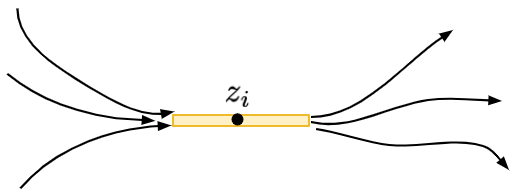
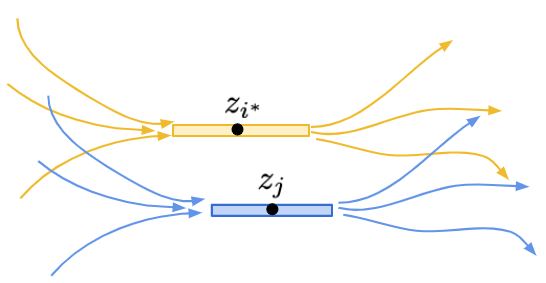

# 偏序集排序（八）

今天來證明定理 29。

## 定理 29

基於貪婪鏈分解的合併排序法，其比較次數 $T_{合併貪婪鏈} \le 6.6 \log e(P) + n$。

首先我們來證明加強版的引理 26。

### 引理 30

對於任意偏序集 $P$，都有 $4\log e(P) + nH(P) \ge n\log n$。

### 引理 30 的證明

證明的方法依舊是數學歸納法（萬用科科），歸納的方向是：讓 $n$ 從小到大、然後對於同樣集合大小的偏序集，根據 $e(P)$ 值由小到大的順序進行歸納（也就是說依照偏序關係的多寡，由大至小歸納）。

**Base Case:** $n=1$ 的時候不等式右邊是 $0$、而左邊非負，結論顯然成立。

**Inductive Case:** 
令偏序集 $(P, <)$ 內的元素為 $x_1, x_2, \ldots, x_n$。我們假設 $z=(z_1, z_2, \ldots, z_n)$ 是直鏈和多胞形 $\mathcal{C}(P)$ 定義出來的最佳化問題的最佳解，也就是 $nH(P) = -\sum_{i=1}^n \log z_i$。
現在令 $i^* = \arg\max_i\{z_i\}$ 是為數值最大的座標，如果有多個座標值相同我們可以隨意挑選一個。

證明的計畫如下：我們如果能找到另一個與 $x_{i^*}$ 無關的元素 $x_j$，然後考慮 $x_{i^*}$ 與 $x_j$ 之間的大小關係。
根據新加入的大小關係，我們可以得到兩種可能的偏序集 $P_1$ 與 $P_2$。此時根據線性延伸 $e(P)$ 的定義，我們知道 $e(P) = e(P_1) + e(P_2)$。其中 $\min\{e(P_1), e(P_2)\}\le \frac12 e(P)$。
不妨假設 $e(P_1)$ 是比較小的那個。那麼，如果能夠透過修改目前達到 $nH(P)$ 的 $z$ 得到另一個座落於 $\mathcal{C}(P_1)$ 內部的座標 $z'$，來證明 $\eqref{eq2}$。就能夠利用數學歸納法，把下列兩式加起來，得到結論。

$$
\begin{eqnarray}
4\log e(P_1) &\le& 4\log e(P) - 4 \\
nH(P_1) & \le& nH(z') = nH(P) + 4 \label{eq2}\tag{*}
\end{eqnarray}
$$

加起來，利用歸納假設可以得到：$4\log e(P) + nH(P) \ge 4\log e(P_1) + nH(P_1) \ge n\log n$。

-----

怎麼把 $z\in \mathcal{C}(P)$ 修改成 $z'\in\mathcal{C}(P_1)$ 又不會使熵值 $nH(P_1)$ 變化太大呢？現在，對於一個 $z_i$，我們想像一下 $z_i$ 是怎麼來的。由於 $z\in \mathcal{C}(P)$，因此所有通過 $x_i$ 的鏈，其對應到的 $z$ 值加總都不超過 $1$。於是，我們可以定義這個點 $x_i$ 的「活動範圍」$[L_i, R_i]$，其中 $L_i = \max_{I(< x_i)} \sum_{k\in I-\{i\}} z_k$，白話來說就是所有以 $x_i$ 為結尾的鏈、不包含 $x_i$ 本身之 $z$ 值總和，的最大值。
而類似地上界可定義為 $R_i=1 - \max_{I(> x_i)} \sum_{k \in I-\{i\}} z_k$，也就是 $x_i$ 後面能夠跟著的鏈的 $z$ 值總和。

由於 $z$ 是最佳化問題的最佳解，所以保證有 $z_i = R_i - L_i$（也就是說左邊的最長鏈與右邊的最長鏈，恰好留給了 $x_i$ 寬度為 $z_i$ 的空間）。若不然，我們可以讓 $z_i$ 的值變大，定義成 $R_i - L_i$，這麼一來 $nH(z)$ 的值會變得更小，與 $z$ 是最佳解矛盾。

在這樣的結構之下，如果有兩個元素 $x_i$ 與 $x_j$ 其對應出來的區間重疊 $(L_i, R_i)\cap (L_j, R_j) = \emptyset$，那麼我們便能保證 $x_i$ 與 $x_j$ 一定不可比較（incomparable）。

-----

### 第一種情況

如果今天有個元素 $x_*$ 無法與 $x_{i^*}$ 進行比較，那麼此時必定存在一條通過 $x_*$ 的鏈，其上頭元素對應到的 $z$ 值總和恰好是 $1$。換句話說，此時必定存在另一個 $z_j$。使得它的活動範圍蓋住 $[L_{i^*}, R_{i^*}]$ 的中點，即 $(L_{i^*}+R_{i^*})/2 \in [L_j, R_j]$，如下圖所示。

這種時候，考慮 $P_1$ 與 $P_2$。無論是何種情形，我們總是可以修改 $z_{i^*}$ 與 $z_j$，把它們變成原本的 $1/4$。這時候，不難說明新的 $z'\in\mathcal{C}(P_1)$ 且 $z'\in\mathcal{C}(P_2)$，如下圖所示：

