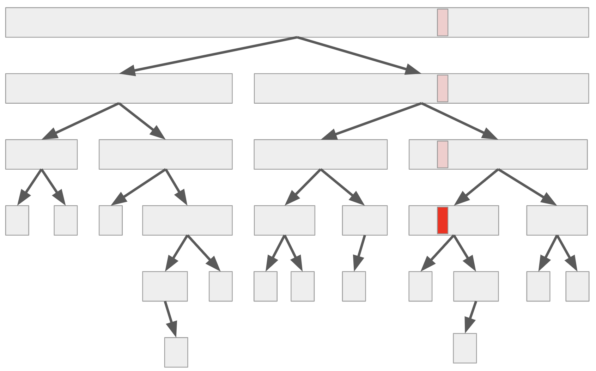

# 隨機快速排序法 3

今天來看看把期望值的可加性發揮到淋漓盡致的一個快速排序法證明。

## 定理 13

假設 `RandomPermute` 可以均勻地產生隨機排列，那麼隨機快速排序法的期望時間複雜度為 $O(n\log n)$。

### 觀察：執行樹

如果我們將快速排序法當中，呼叫遞迴解決子問題的所有過程記錄下來，可以描繪出一個樹狀結構。
其中每一個節點都是代表一次的 `QuickSort()` 呼叫，葉子節點對應到的就是那些 $n\le 1$ 的邊界條件。

考慮任何一筆資料（如上圖紅色部分），則這筆資料**參與**了許多子問題的計算：包含一開始的整個問題（根節點），直到這筆資料被選為 pivot、或是整個子問題唯一的輸入，才停止參與在演算法的執行之中。
對於每一個子問題，快速排序法對於該次遞迴的執行時間（不計遞迴子問題的時間）其實是線性的。
因此，若我們令隨機變數 $X_i$ 表示資料 $i$ 參與的子問題數目，那麼整體的執行時間 $X$ 將正比於每一筆資料參與的子問題數目總和，即 $X = X_1+X_2+\cdots + X_n$。

### 證明

既然已將執行時間拆開，利用期望值的可加性，我們只要找出每一個隨機變數 $X_i$ 的期望值，並且加起來就行了！
而事實上，我們如果著眼在某個特定資料 $i$，那麼「隨機選 pivot 並且遞迴下去」的過程，就可以想像成：不斷地隨機選取一個資料，並且把所有跟 $i$ 不在同一邊的資料丟掉。現在來看看一個決定性的觀察：

#### 引理 15

假設子問題大小為 $k$。那麼，無論我們關心的資料 $i$ 的排序位置如何，均勻地隨機選取一筆資料作為 pivot 後，至少有 $\ge 1/3$ 的機率使得包含 $i$ 的子問題大小變成 $\le (2/3)k$。

#### 引理 15 的證明

可以證明，只有在選到排名前 $1/3$ 的資料、或選到後 $1/3$ 的資料作為 pivot 的時候，才有可能讓 $i$ 所在的子問題保有至少 $(2/3)k$ 筆資料。因此其他情形（至少有 $1/3$ 的機率）都會讓子問題數量縮小 $2/3$ 倍。

-----

有了引理 15 以後，我們可以計算出 $\E[X_i]$ 的上界了。由於讓子問題縮小 $2/3$ 倍這件事情，從任何一個資料的角度來看，只會發生至多 $\log_{3/2} n$ 次。這是因為子問題的大小都是整數，一旦子問題大小小於 1 了遞迴就自然會停下來。
因此，我們可以把 $X_i$ 拆成許多連續的子問題片段：$X_i = Z_{i, 1} + Z_{i, 2} + \cdots + Z_{i, {\log_{3/2}} n}$。其中 $Z_{i, j}$ 表示從第 $j-1$ 次把子問題縮小 $2/3$ 到第 $j$ 次把子問題縮小 $2/3$（或遞迴停止）之間，到底經歷了幾個子問題。
不難發現，因為每一次挑選 pivot 都是隨機地選，而且有至少 $1/3$ 的機率會讓子問題縮小 $2/3$。因此 $\E[Z_{i, j}] \le 3$。
於是，我們可以知道 $\E[X_i] \le 3\log_{3/2} n$，因此 $\E[X]\le 3n\log_{3/2} n = O(n\log n)$。

-----

哈！我們利用把整個執行樹展開的觀念，成功避免掉了數學歸納法了。
