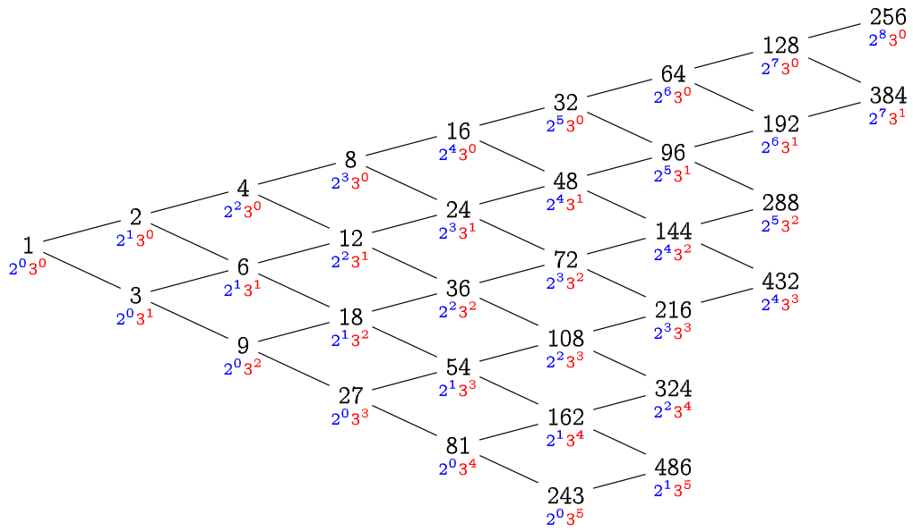

# 謝耳排序法（三）

利用湊郵票問題（引理 34、係理 35）的性質，我們可以專注在 $2$-sorted 和 $3$-sorted 上面，
並且推廣它：

### 引理 37

令 $h$ 為一個正整數。若一個長度為 $N$ 的陣列 $A$ 已經滿足 $2h$-sorted 且為 $3h$-sorted，那麼將陣列整理成 $h$-sorted，僅需要花費 $O(N)$ 的時間。

### 引理 37 的證明

因為陣列已經是 $2h$-sorted 與 $3h$-sorted 的關係，
如果要把它整理成 $h$-sorted，對於任何註標 $i$，我們只需要考慮 $A[i]$ 與 $A[i\pm h]$ 之間的大小關係就好。
也就是說，對於 `h_sort` 的第二層進行插入排序的迴圈，總是跑了常數次就會停下來。因此整體時間複雜度是 $O(N)$。
<span style="float:right">$\square$</span>

我們可以從引理 37 進行逆向思考：
最終的目的是 $1$-sorted（也就是完全排序），為了讓「整理成 $1$-sorted」這件事情能在 $O(N)$ 做到，我們首先必須要讓陣列變成 $2$-sorted 以及 $3$-sorted。
為了讓「整理成 $2$-sorted」和「整理成 $3$-sorted」也都能在 $O(N)$ 做到，我們必須讓陣列分別滿足 $4$-sorted、 $6$-sorted、以及 $9$-sorted。以 $N=500$ 為例，依此類推我們可以畫出以下的關係圖：



只要按照上圖中所有出現過形如 $2^a3^b < N$ 的數字，從大到小依序 `h_sort` 一遍，就能夠保證每一次 `h_sort` 都僅花費 $O(N)$ 的時間。
總共有多少個這樣的數字呢？從這張「二維」表格看起來，我們能輕易得到一個上界：至多只有 $\log_2N\log_3N=\Theta(\log^2N)$ 個數字滿足條件。因此，我們能得到以下結論：

### 定理 38 [Pratt 1972]

使用所有形如 $2^a3^b$ 的整數作為步長序列，其謝耳排序法的時間複雜度為 $O(N\log^2 N)$。
<span style="float:right">$\square$</span>

### 題外話之一

假設步長序列的長度為 $m$，我們可以在 $O(m)$ 時間內，產生出所有必要的步長，並且由小到大排好順序。
方法與霍夫曼編碼、或合併排序法的合併概念相當類似：我們只要把所有產生出來的步長依照大小順序塞入兩個有序數列即可。

```cpp
// 由小到大找出所有小於 N、且質因數只有 2 和 3 的所有正整數。
vector<int> generate_steps(int N) {
  queue<int> twos = {2}, threes = {3};
  vector<int> result = {1};
  while (twos.front() < N && threes.front() < N) {
    // 每一次從兩個序列中挑選小的那個，放入序列，並拓展接下來的數字。
    auto& smaller_queue = (twos.front() < threes.front()? twos : threes);
    int new_step = smaller_queue.front();
    smaller_queue.pop();
    if (result.back() != smaller_queue.front()) {
      result.push_back(new_step);
      twos.push(new_step * 2);
      threes.push(new_step * 3);
    }
  }
  return result;
};
```

-----

### 題外話之二

關於謝耳排序法的正確性，其實用到了一個重要的非顯然性質，描述如下：

### 性質 39

令 $h$ 和 $h'$ 為兩個正整數，且 $h > h'$。假設陣列 $A$ 已經是 $h$-sorted，那麼對較小的步長 $h'$ 呼叫 `h_sort` 重新整理後，這個陣列仍然是 $h$-sorted 的。
換句話說，在謝耳排序法之中，若一個陣列已經是 $h$-sorted 了，那麼它終生都是 $h$-sorted[^1]。
各位朋友有興趣的話可以證明看看唷。

-----

在 Pratt 給出了非常漂亮的步長序列[^2]以後，大家對於步長序列的長度 $m$ 與對應之謝耳演算法效率之間的權衡產生了興趣。
為了突破 $O(N\log^2N)$ 時間複雜度，勢必要縮短步長。
明天我們先從 $N^{1+O(1/\sqrt{m})}$ 的謝耳排序演算法開始，然後試圖解釋為什麼**不存在** $O(N\log N)$ 的謝耳排序法。


[^1]: [一日XX 終身XX](https://www.ptt.cc/bbs/Tech_Job/M.1452353440.A.D62.html)

[^2]: Vaughan R. Pratt, _Shellsort and Sorting Networks_, Ph.D Thesis, Stanford University, 1972. [https://apps.dtic.mil/dtic/tr/fulltext/u2/740110.pdf](https://apps.dtic.mil/dtic/tr/fulltext/u2/740110.pdf)