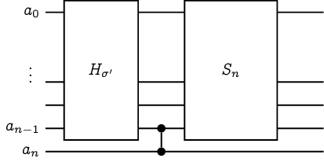
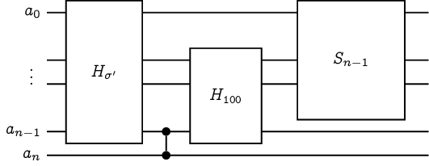

# 驗證排序網路

給定一個排序網路，我們有沒有什麼樣的演算法可以檢驗這個排序網路能否正確排序呢？
假設我們要排序的資料數量有 $n$ 筆、排序網路的總工作量為 $m$ 次比較。
顯然我們有個 $O(m\cdot n!)$ 時間的演算法：枚舉所有 $n!$ 種排列，並且實際丟進去排序看看。

## 0-1 法則 Zero-One Principle

一個值得提及的觀察是，我們不一定需要枚舉所有的 $n!$ 種排列。如果對於任何 $k$，只要該排序網路都能夠分得出前 $k$ 小的資料、與剩下的 $n-k$ 筆資料，就能夠保證排好所有資料了。有了這個觀察，我們可以將 $n!$ 種排列的檢驗過程，精簡至 $2^n-n-1$ 種輸入即可：只要能夠對所有長度為 $n$ 的任意亂序 0-1 序列排序，就能保證排序網路的正確性。

## 0-1 法則的限制

真的需要檢查所有的 $2^n-n-1$ 種 0-1 序列（任意未按順序排列之 0-1 序列）才能保證排序網路的正確性嗎？很遺憾地，是的，我們可以藉由以下引理得知，如果我們採用 0-1 序列作為排序網路的測試，我們至少需要 $2^n-n-1$ 種不同的輸入才行。

### 引理 44 [Chung-Ravikumar 1990, Knuth 1997]

令 $\sigma$ 是一個長度為 $n$ 的亂序 0-1 序列，那麼存在一個排序網路 $H_\sigma$，可以排好所有 $\sigma$ 以外的 0-1 序列，唯獨 $\sigma$ 無法被正確排序。

### 歷史備註

Chung 和 Ravikumar 在 1990 年出版的論文中，其實有幾個滿慘烈的錯誤。這邊採用的證明是 Knuth 在 TAOCP Vol 3 裡面的精妙解答。

### 引理 44 的證明

萬能的數學歸納法是你的好朋友。我們可以對序列長度 $n$ 進行歸納：當 $n=2$ 的時候，唯一的亂序序列是 $\tt{10}$，一個空的排序網路就能夠達到我們的需求。當 $n=3$ 的時候，我們可以針對每一種亂序序列繪製出如下圖所示的排序網路[^1]：

從上圖可以發現，對於任何指定的亂序 0-1 序列 $\sigma$，設計出來的 $H_\sigma$ 確實可以排好除了 $\sigma$ 以外的所有序列，厲害吧！下一步我們要做的事情，就是把 $n=3$ 推廣到所有更大的 $n$。

#### 歸納假設：假定 $n$ 搞定了，$n+1$ 呢？

現在我們考慮任何一個長度為 $n+1$ 的亂序 0-1 序列 $\sigma$。由於 $\sigma$ 是亂序，要嘛它的前 $n$ 個位元是亂序的、要嘛它的後 $n$ 個位元是亂序的。根據對稱性，我們**不妨**假設前 $n$ 個位元 $\sigma' = \sigma[0..n-1]$ 是亂序的。現在有三種可能的情形：

* 情形一：$\sigma[n]=\mathtt{0}$ 且 $H_{\sigma'}(\sigma')[n-1]=\mathtt{0}$、
* 情形二：$\sigma[n]=\mathtt{0}$ 且 $H_{\sigma'}(\sigma')[n-1]=\mathtt{1}$、
* 情形三：$\sigma[n]=\mathtt{1}$。

#### 情形一

對於第一種情形，我們可以考慮建構如下圖所示的 $H_\sigma$：

通過一番考證，我們可以發現，若輸入的序列 $a_0, \ldots, a_n$ 剛好為 $\sigma$ 時，由於 $H_{\sigma'}(\sigma')[n-1] = 0$，因此最終通過排序後最後一個位元仍然是 $0$。由於 $\sigma$ 為亂序 (至少有一個 1)，所以輸入為 $\sigma$ 時 $H_\sigma$ 無法排好序。相反地，若輸入的序列 $a_0, \ldots, a_n\neq \sigma$ 時，有兩種情形：

* 若 $a_0, \ldots, a_{n-1}=\sigma'$：此時 $a_n=1$，通過排序網路以後仍然為 $1$。由於 $S_n$ 為一個正確的排序網路，我們得知此時 $H_\sigma$ 可以正確地輸出排序後的結果。
* 若 $a_0, \ldots, a_{n-1}\neq \sigma'$：此時根據歸納假設，$H_{\sigma'}$ 必定正確地排序。若 $a_1, \ldots, a_n$ 為亂序，此時保證 $a_0, \ldots, a_{n-1}$ 至少有個 $1$。這會導致通過 $H_{\sigma'}$ 以後的最後一個位元為 $1$、通過中間的比較器後，最後一個位元為 $1$。因此 $H_\sigma$ 此時可以正確輸出排序後的結果。

#### 情形二

類似地，我們考慮建構如下圖所示的 $H_\sigma$：

由於 $H_{\sigma'}$ 在輸入為 $\sigma'$ 的時候輸出並非排序後的結果，這代表了必定存在一前一後的兩個輸出位置依序為 1 以及 0 （也就是說，存在某個 $i$ 使得 $H_{\sigma'}(\sigma')[i] = \texttt{1}$、$H_{\sigma'}(\sigma')[i+1] = \texttt{0}$）。根據情形二的假設，我們知道 $H_{\sigma'}(\sigma')[n-1] = \texttt{1}$，因此 $i < n-2$。
此時，我們特別將 $i$、$i+1$、$n-1$ 這三個位置的輸出額外接入一個 $H_{\texttt{100}}$。最後我們對前 $n-1$ 筆資料直接利用 $S_{n-1}$ 直接排序。

接下來就是驗證輸入的階段啦。若輸入的序列恰好是 $a_0, a_1, \ldots, a_n = \sigma$，在經過第一塊 $H_{\sigma'}$ 排序網路後，最後兩個位元會被交換，從而導致 $H_{\texttt{100}}$ 的輸入和輸出都是 $\texttt{100}$。這時送入 $S_{n-1}$ 的輸入位元中至少有個 $\texttt{1}$ (來自 $H_{\texttt{100}}$ 的輸出)，因此最終輸出結果的最後三個位元依序為 1、0、1，顯然沒有正確排序。相反地，假若 $a_0, a_1, \ldots, a_n \neq \sigma$，同樣地，我們有兩種情形：

* 若 $a_0, \ldots, a_{n-1}=\sigma'$：此時 $a_n=1$，因此送入 $H_{\texttt{100}}$ 的輸入必定不是 $\texttt{100}$，從而導致最後兩個位元保持為 $\texttt{1}$，因此輸出結果為已排序。
* 若 $a_0, \ldots, a_{n-1}\neq \sigma'$，此時 $H_{\sigma'}$ 的輸出為已排序，因此通過 $H_{\sigma'}$ 以後，最後一個位元

#### 情形三

## 是否存在更有效率的演算法呢？

聰明的你可能馬上注意到了：如果我們只是想知道這個排序網路是否能夠正確排序，不見得需要實際去跑這個排序網路呀！說不定有更有效率的演算法，直接判斷它。

不過呢，很可惜地，這個問題其實是 $\mathsf{coNP}$-完備的。我們可以直接地將著名的 $\mathsf{coNP}$-完備問題：恆真命題(Tautology)

### 參考資料

* [StackExchange 上面的提問](https://cs.stackexchange.com/questions/44748/how-do-i-tell-if-a-comparison-network-sorts)
* Ian Parberry, [On the Computational Compexity of Optimal Sorting Network Verification](https://link.springer.com/chapter/10.1007%2F978-3-662-25209-3_18), PPAL'91.
* Moon Jung Chung and B. Ravikumar, [Bounds on the size of test sets for sorting and related networks](https://www.sciencedirect.com/science/article/pii/0012365X9090173F?via%3Dihub), Discrete Mathematics 1990.
* 0-1 法則參見 CLRS 演算法課本中題目 Problem 8-7 _The 0-1 sorting lemma_，而這個稱呼最早似乎是由 Knuth 在他的著作 _The art of computer programming_ 裡面提及的。
* UIUC 任教的 Sariel Har-Peled 教授的上課講義 https://sarielhp.org/teach/2004/b/webpage/lec/14_sortnet_notes.pdf
* Knuth 的 TAOCP Vol. 3, page 244, 習題 56 （解答在 page 673)。

[^1]: 原本的論文好像有兩張圖畫反了的樣子...