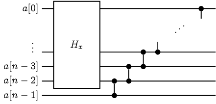
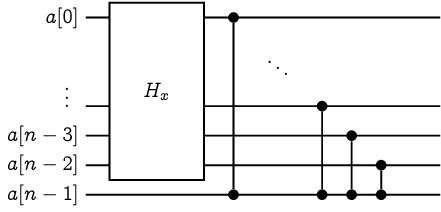
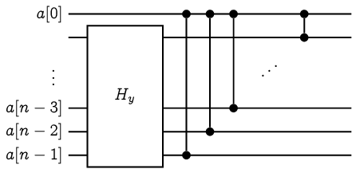
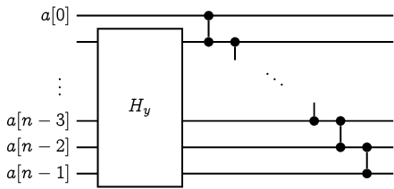

# 驗證排序網路

給定一個排序網路，我們有沒有什麼樣的演算法可以檢驗這個排序網路能否正確排序呢？
假設我們要排序的資料數量有 $n$ 筆、排序網路的總工作量為 $m$ 次比較。
顯然我們有個 $O(m\cdot n!)$ 時間的演算法：枚舉所有 $n!$ 種排列，並且實際丟進去排序看看。

## 0-1 法則 Zero-One Principle

一個值得提及的觀察是，我們不一定需要枚舉所有的 $n!$ 種排列。如果對於任何 $k$，只要該排序網路都能夠分得出前 $k$ 小的資料、與剩下的 $n-k$ 筆資料，就能夠保證排好所有資料了。有了這個觀察，我們可以將 $n!$ 種排列的檢驗過程，精簡至 $2^n-n-1$ 種輸入即可：只要能夠對所有長度為 $n$ 的任意亂序 0-1 序列排序，就能保證排序網路的正確性。

## 0-1 法則的限制

真的需要檢查所有的 $2^n-n-1$ 種 0-1 序列（任意未按順序排列之 0-1 序列）才能保證排序網路的正確性嗎？很遺憾地，是的，我們可以藉由以下引理得知，如果我們採用 0-1 序列作為排序網路的測試，我們至少需要 $2^n-n-1$ 種不同的輸入才行。

### 引理 44 [Chung-Ravikumar 1987, Knuth 1997]

令 $\sigma$ 是一個長度為 $n$ 的亂序 0-1 序列，那麼存在一個排序網路 $H_\sigma$，可以排好所有 $\sigma$ 以外的 0-1 序列，唯獨 $\sigma$ 無法被正確排序。

我們不妨將這樣的排序網路稱為**關於 $\sigma$ 的阿基里斯的排序網路** (Achilles' Sorting Network of $\sigma$) 吧！其實這被稱作 single exception sorting networks[^1]。

### 引理 44 的證明

萬能的數學歸納法是你的好朋友。我們可以對序列長度 $n$ 進行歸納：當 $n=2$ 的時候，唯一的亂序序列是 $\tt{10}$，一個空的排序網路就能夠達到我們的需求。

### 更強的歸納假設

Knuth 在他的書籍當中針對這樣的阿基里斯排序網路給了一個更強的要求：若 $\sigma$ 恰好包含 $k$ 個 $\texttt{0}$ 以及 $n-k$ 個 $\tt{1}$，那麼 
$$H_\sigma(\sigma) = {\tt{0}}^{k-1}\texttt{10}{\tt{1}}^{n-k-1}$$
換句話說，Knuth 對於這個不正確的排序有著嚴格的定義。而歸納初始條件 $n=2$ 時，空的排序網路也剛好滿足了這樣的定義。

現在給定 $n\ge 3$，讓我們假設對於所有 $n' < n$ 的任何亂序 0-1 序列 $\sigma'$，都存在該序列的阿基里斯排序網路 $H_\sigma'$。

### 歸納的部分

令 $\sigma[0..n-1]$ 是一個長度為 $n$ 的亂序 0-1 序列。由於 $\sigma$ 是亂序，前 $n-1$ 個位元 $x:=\sigma[0..n-2]$ 或後 $n-1$ 個位元 $y:=\sigma[1..n-1]$ 其中之一必定也是亂序。我們可以根據 $x$ 和 $y$ 是否為亂序、以及剩下一個位元是 0 或 1，分成以下四種情形並且建構 $H_\sigma$。

<table>
<tr>
<td>

**Case 1** 
$\sigma=x\texttt{0}$ 且 $x$ 為亂序

</td>
<td>

</td>
</tr>
<tr>
<td>

**Case 2** 
$\sigma=x\texttt{1}$ 且 $x$ 為亂序

</td>
<td>

</td>
</tr>
<tr>
<td>

**Case 3** 
$\sigma=\texttt{0}y$ 且 $y$ 為亂序

</td>
<td>

</td>
</tr>
<tr>
<td>

**Case 3** 
$\sigma=\texttt{1}y$ 且 $y$ 為亂序

</td>
<td>

</td>
</tr>
</table>

在加強了歸納假設以後，排序網路給出來的結果變得更好驗證了。
筆者強烈建議大家試著跑看看上述的排序網路（挑選一個 case、並試著將 $\sigma$ 以及任何 $\neq\sigma$ 序列丟進去跑看看。）就能理解為什麼這個建構是正確的。在驗證的過程中，或許也能得到一個屬於自己的 "Aha-Moment"！

### 歷史備註

[Chung](https://www.cse.msu.edu/~chung/) 和 [Ravikumar](https://homepage.cs.uri.edu/faculty/ravikumar/) 在 1990 年出版的論文中，其實有幾個滿慘烈的小狀況，比如論文中第一張圖片內的 $H_{010}$ 和 $H_{101}$ 兩個排序網路畫反了、更嚴重的包含被原作者忽略掉證明的 Case B (圖片 4) 的建構似乎是不完全正確的。
但這並不影響這篇論文對於『驗證排序網路』提出重要觀察的地位。筆者在這邊採用的證明是 Knuth 在 TAOCP Vol 3 裡面的精妙解答。

## 是否存在更有效率的演算法呢？

聰明的你可能馬上注意到了：如果我們只是想知道這個排序網路是否能夠正確排序，不見得需要實際去跑這個排序網路呀！說不定有更有效率的演算法，直接判斷它。

不過呢，很可惜地，這個問題其實是 $\mathsf{coNP}$-完備的。一般來說可以從著名的 $\mathsf{coNP}$-完備問題 『恆真問題』(Tautology) 轉化之。
早在 1980 年，[Rabin](https://en.wikipedia.org/wiki/Michael_O._Rabin) 提出了從『三維匹配』轉化到『測試排序網路』的證明 ([Johnson](https://en.wikipedia.org/wiki/David_S._Johnson) 說是 private communication，那就是 private communication)。
而這個問題也被收錄在 1982 年由 Johnson 把各種 NP 和 coNP 完備問題蒐整的專欄[^4]當中。在 Knuth 的書中[^5]也鉅細彌遺地給出了轉化方式。
Chung 與 Ravikumar 在提出了測試排序網路的論文後，在同一年間他們也證明了這個問題是 $\mathsf{coNP}$-完備的[^2] (他們強調在論文中使用了新的轉化方法，能夠證明更多問題是 $\mathsf{NP}$-完備或 $\mathsf{coNP}$-完備的，不只是測試排序網路問題。
後續如 [Ian Parberry](https://ianparberry.com/) 提出了更淺的構造方法[^3]，讓這個問題在各種更自然的設定底下都是 $\mathsf{coNP}$-完備的。

如果你能夠設計出一個多項式時間的演算法，測試一個排序網路是否總能正確排序，那麼事情就大條了(稱讚意味)！

### 參考資料

* [StackExchange 上面的提問](https://cs.stackexchange.com/questions/44748/how-do-i-tell-if-a-comparison-network-sorts)
* Moon Jung Chung and B. Ravikumar, [Bounds on the size of test sets for sorting and related networks](https://www.sciencedirect.com/science/article/pii/0012365X9090173F?via%3Dihub), Discrete Mathematics 1990. (Conference version: International Conference on Parallel Processing, 1987.)
* 0-1 法則參見 CLRS 演算法課本中題目 Problem 8-7 _The 0-1 sorting lemma_，而這個稱呼最早似乎是由 Knuth 在他的著作 _The art of computer programming_ [Knuth 1973] 裡面提及的。
* UIUC 任教的 Sariel Har-Peled 教授的上課講義 [https://sarielhp.org/teach/2004/b/webpage/lec/14_sortnet_notes.pdf](https://sarielhp.org/teach/2004/b/webpage/lec/14_sortnet_notes.pdf)
* Knuth 的 TAOCP Vol. 3, page 244, 習題 56 （解答在 page 673)。

[^1]: Ian Parberry, [On the Computational Compexity of Optimal Sorting Network Verification](https://link.springer.com/chapter/10.1007%2F978-3-662-25209-3_18), PPAL'91.

[^4]: David S. Johnson, [The NP-Completeness Column: An Ongoing Guide](https://www.sciencedirect.com/science/article/abs/pii/0196677482900268), J. Algorithms, 1982.

[^5]: Knuth 的 TAOCP Vol. 3, page 242, 習題 52 （解答在 page 672)。

[^2]: Moon Jung Chung and B. Ravikumar, [Strong nondeterministic Turing reduction - a technique for proving intractability](https://www.sciencedirect.com/science/article/pii/0022000089900172), J. Computer and System Sciences, 1989. (Conference version: Annual Conference on Structure in Complexity Theory, 1987.)

[^3]: Ian Parberry, [Single-exception sorting networks and the computational complexity of optimal sorting network verification](https://link.springer.com/article/10.1007/BF02090767), Mathematical systems theory, 1990.