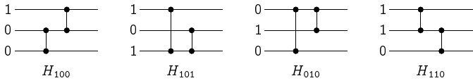

# 驗證排序網路

給定一個排序網路，我們有沒有什麼樣的演算法可以檢驗這個排序網路能否正確排序呢？
假設我們要排序的資料數量有 $n$ 筆、排序網路的總工作量為 $m$ 次比較。
顯然我們有個 $O(m\cdot n!)$ 時間的演算法：枚舉所有 $n!$ 種排列，並且實際丟進去排序看看。

## 0-1 法則 Zero-One Principle

一個值得提及的觀察是，我們不一定需要枚舉所有的 $n!$ 種排列。如果對於任何 $k$，只要該排序網路都能夠分得出前 $k$ 小的資料、與剩下的 $n-k$ 筆資料，就能夠保證排好所有資料了。有了這個觀察，我們可以將 $n!$ 種排列的檢驗過程，精簡至 $2^n-n-1$ 種輸入即可：只要能夠對所有長度為 $n$ 的任意亂序 0-1 序列排序，就能保證排序網路的正確性。

## 0-1 法則的限制

真的需要檢查所有的 $2^n-n-1$ 種 0-1 序列（任意未按順序排列之 0-1 序列）才能保證排序網路的正確性嗎？很遺憾地，是的，我們可以藉由以下引理得知，如果我們採用 0-1 序列作為排序網路的測試，我們至少需要 $2^n-n-1$ 種不同的輸入才行。

### 引理 44 [Chung-Ravikumar 1990]

令 $\sigma$ 是一個長度為 $n$ 的亂序 0-1 序列，那麼存在一個排序網路 $H_\sigma$，可以排好所有 $\sigma$ 以外的 0-1 序列，唯獨 $\sigma$ 無法被正確排序。

### 引理 44 的證明

萬能的數學歸納法是你的好朋友。我們可以對序列長度 $n$ 進行歸納：當 $n=2$ 的時候，唯一的亂序序列是 $\tt{10}$，一個空的排序網路就能夠達到我們的需求。當 $n=3$ 的時候，我們可以針對每一種亂序序列繪製出如下圖所示的排序網路[^1]：

從上圖可以發現，對於任何指定的亂序 0-1 序列 $\sigma$，設計出來的 $H_\sigma$ 確實可以排好除了 $\sigma$ 以外的所有序列，厲害吧！下一步我們要做的事情，就是把 $n=3$ 推廣到所有更大的 $n$。

#### 歸納假設：假定 $n$ 搞定了，$n+1$ 呢？

現在我們考慮任何一個長度為 $n+1$ 的亂序 0-1 序列 $\sigma$。我們令前 $n$ 個位元為 $\sigma' = \sigma[0..n-1]$。現在有三種可能的情形：

* 情形一：$\sigma'$ 是亂序且 $\sigma[n]=\mathtt{0}$、
* 情形二：$\sigma'$ 是亂序且 $\sigma[n]=\mathtt{1}$、
* 情形三：$\sigma'$ 已排序（此時 $\sigma[n]$ 必定是 $\mathtt{0}$）

## 關於驗證排序網路這個問題

這個問題其實是 $\mathsf{coNP}$-完備的。

### 參考資料

* [StackExchange 上面的提問](https://cs.stackexchange.com/questions/44748/how-do-i-tell-if-a-comparison-network-sorts)
* Ian Parberry, [On the Computational Compexity of Optimal Sorting Network Verification](https://link.springer.com/chapter/10.1007%2F978-3-662-25209-3_18), PPAL'91.
* Moon Jung Chung and B. Ravikumar, [Bounds on the size of test sets for sorting and related networks](https://www.sciencedirect.com/science/article/pii/0012365X9090173F?via%3Dihub), Discrete Mathematics 1990.
* 0-1 法則參見 CLRS 演算法課本中題目 Problem 8-7 _The 0-1 sorting lemma_，而這個稱呼最早似乎是由 Knuth 在他的著作 _The art of computer programming_ 裡面提及的。

[^1]: 原本的論文好像有兩張圖畫反了的樣子...