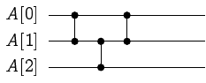
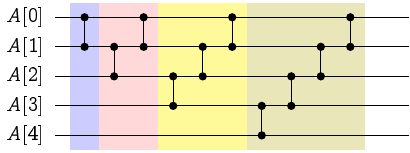

# 排序網路 Sorting Networks

既然謝耳排序法被證明了「不可能達到 $O(n\log n)$ 時間複雜度」，那為什麼它仍然如此地被大家廣泛提起呢？

原因在於可以**無視資料內容**(Data-Oblivious)而達到排序目的之設計。
想像一下你手上有一些**比較器**(Comparator)：這些比較器有兩個輸入、也有兩個輸出。無論輸入的值是如何，比較小的輸入值總是會出現在第一個輸出位置、而較大的輸入值總會出現在第二輸出位置。你能否設計出一連串「使用比較器」的順序，在不查看資料內容的情形下，保證將 $n$ 筆資料進行排序呢？如果可以，這個方法就被稱為「無視資料內容的排序演算法[^1]」。

舉例來說，如果我們想要排序 3 筆資料：$A[0], A[1], A[2]$。我們可以設計出以下的演算法：
* 第一步：比較並交換 $A[0]$、$A[1]$
* 第二步：比較並交換 $A[1]$、$A[2]$
* 第三步：比較並交換 $A[0]$、$A[1]$

不難證明，無論原始的資料是如何排列的，經過這三步以後，保證有 $A[0] \le A[1]\le A[2]$。因此，上面描述的這個演算法，是一個可以對 $n=3$ 筆資料進行排序的無視資料內容排序演算法。有了無視資料內容的排序演算法之後，我們便能夠很輕易地將這個「程式」燒製成「硬體」，利用硬體方法將資料進行排序，使得排序所需要的時間大幅度地減少。

而這個排序的過程，我們可以用排序網路（Sorting Network）來表示之：

由左而右，我們可以把每一次使用比較器的順序繪製出來。這麼繪製有什麼好處呢？一方面我們可以直接利用連接電路的方式，把比較器依序安裝在這些位置上，另一方面，我們也可以清楚地知道，哪些比較可以同時進行、又或是那些比較之間會有相依順序。如果我們允許同時進行許多互不相干的比較，那麼，整個排序網路的長度，就會對應著該排序演算法所需要的「最少時間」(我們稱之為**深度 depth**)。而整體的比較器數量，我們將之定義為**總工作量 work**。

## 無視資料內容的插入排序法

在文章的一開始，我們有提到謝耳排序法可以被實作成無視資料內容的排序演算法。具體來說該如何實作（或是描述）這個排序網路呢？由於謝耳排序法本身可以視為由不同步長的「插入排序」所組成的排序演算法（換句話說，插入排序法其實就是步長序列為 $h = [1]$ 的謝耳排序法），我們可以把插入排序法對應的排序網路繪製出來：

上圖是一個使用插入排序法排序 5 筆資料的排序網路。我們不難發現推廣到 $N$ 筆資料的時候，其排序網路的深度是 $N$、而且總工作量為 $O(N^2)$。把這個概念推廣到 Pratt 版本的 $2^a3^b$-謝耳排序法以後，就會得到以下結論：

### 係理 43

存在一個深度為 $O(\log^2 N)$、且總工作量為 $O(N\log^2 N)$ 的排序網路。

### 係理 43 的證明

每一筆資料在每一次的 $h$-sort 裡面，都只會被比較到 $O(1)$ 次，因此該排序網路其深度為  $O(\log^2 N)$。
$\square$

-----

由於建構一個 $2^a3^b$ 步長序列的排序網路，需要先行計算出各種不同的步長，實在是沒有那麼直覺。在排序網路這個課題底下，應該有著其他種類的建構方式才對。此外，我們不禁提出以下幾個疑問：其一，$O(\log^2 N)$ 這個深度是否是極限了呢？其二，在傳統計算模型下，是存在只需要 $O(N\log N)$ 次排序的排序演算法的。在排序網路的世界中，是否存在比 $O(N\log^2 N)$ 更佳的總工作量的排序網路呢？

這個世界上顯然還是存在著各式各樣有趣的排序演算法呀！我們之後就來一一介紹。但在此之前，我想先從另一個角度（編按：驗證而非建構）討論排序網路：給定一個排序網路，我們有沒有什麼演算法來驗證它的正確性呢？

### 參考資料

* matrix67 神人的部落格 [簡單談談排序網路](http://www.matrix67.com/blog/archives/185)
* 維基百科的[排序網路](https://en.wikipedia.org/wiki/Sorting_network)

[^1]: 在 CLRS 演算法課本裡面這類型的演算法被稱為 **oblivious compare-exchange algorithm**。
